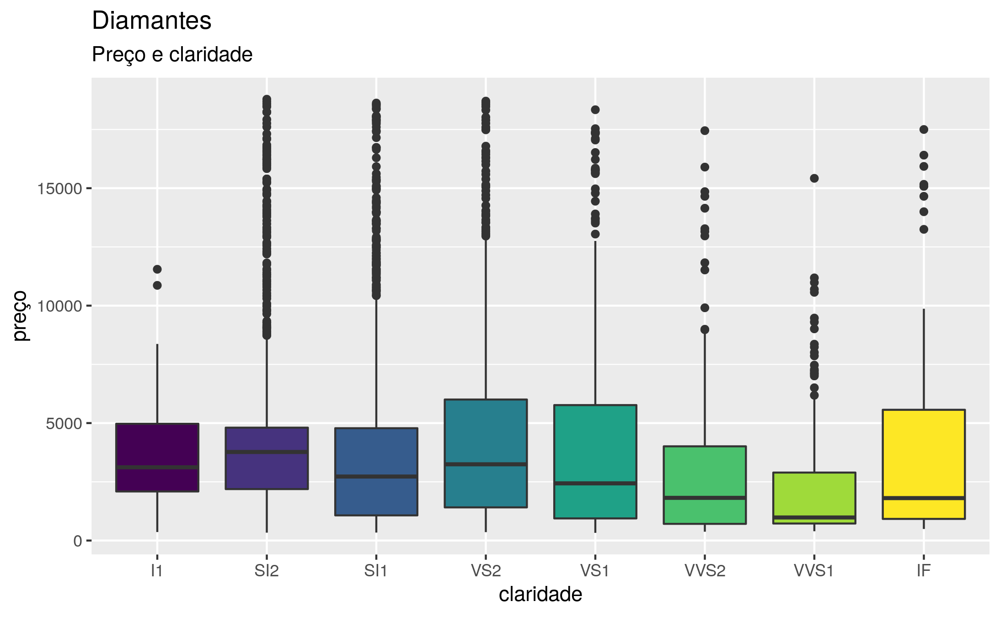

<!-- README.md is generated from README.Rmd. Please edit that file -->

# dados 

<!-- badges: start -->

[](https://cran.r-project.org/package=dados)
[](https://github.com/cienciadedatos/dados/actions)
<!-- badges: end -->

Este pacote disponibiliza a tradução de conjuntos de dados em inglês
originalmente disponíveis em outros pacotes de R. Os dados traduzidos
são utilizados nos exemplos do livro [R for Data
Science](https://r4ds.had.co.nz/) de Hadley Wickham & Garrett Grolemund,
cuja [versão em
português](https://www.altabooks.com.br/produto/r-para-data-science-importe-arrume-transforme-visualize-e-modele-dados/)
foi publicada por AltaBooks & O’Reilly.

## Instalação

Este pacote pode ser instalado a partir do CRAN:

``` r
install.packages("dados")
```

A versão de desenvolvimento pode ser instalada a partir do GitHub:

``` r
# install.packages("remotes")
remotes::install_github("cienciadedatos/dados")
```

## Traduções

As traduções disponíveis dentro de `dados` são as seguintes:

| Nome                     | Título                                                                              | Pacote         | Dataset          |
|:-------------------------|:------------------------------------------------------------------------------------|:---------------|:-----------------|
| casas                    | Dados de habitação em Ames                                                          | AmesHousing    | ames\_raw        |
| bebes                    | Nomes de bebês                                                                      | babynames      | babynames        |
| velho\_fiel              | Dados do gêiser Velho Fiel (Old Faithful)                                           | datasets       | faithful         |
| dados\_iris              | Dados de espécies de flor de Íris por Edgar Anderson                                | datasets       | iris             |
| mtcarros                 | Testes de estrada para automóveis                                                   | datasets       | mtcars           |
| dados\_starwars          | Personagens de Starwars                                                             | dplyr          | starwars         |
| questionario             | Amostra de variáveis categóricas do questinário ‘General Social Survey’ (GSS)       | forcats        | gss\_cat         |
| comuns                   | Modelos comuns de carros                                                            | fueleconomy    | common           |
| veiculos                 | Dados de economia de combustível                                                    | fueleconomy    | vehicles         |
| dados\_gapminder         | Dados de Gapminder                                                                  | gapminder      | gapminder        |
| diamante                 | Preço de 50 mil diamantes                                                           | ggplot2        | diamonds         |
| milhas                   | Dados de economia de combustível de 1999 a 2008 para 38 modelos populares de carros | ggplot2        | mpg              |
| presidentes\_eua         | Período que engloba 11 presidentes, desde Eisenhower até Obama                      | ggplot2        | presidential     |
| premios\_gerentes        | Tabela de prêmios dos gerentes                                                      | Lahman         | AwardsManagers   |
| rebatedores              | Tabela de estatíticas de Beisebol                                                   | Lahman         | Batting          |
| jardineiros              | Tabela de estatísticas do jardineiro                                                | Lahman         | Fielding         |
| gerentes                 | Tabela de gerentes                                                                  | Lahman         | Managers         |
| pessoas                  | Tabela de pessoas                                                                   | Lahman         | People           |
| arremesadores            | Tabela de estatísticas de arremesadores                                             | Lahman         | Pitching         |
| salarios                 | Tabela de salários                                                                  | Lahman         | Salaries         |
| dados\_atmosfera         | Dados atmosféricos                                                                  | nasaweather    | atmos            |
| companhias\_aereas       | Nomes de companhias aéreas                                                          | nycflights13   | airlines         |
| aeroportos               | Aeroportos                                                                          | nycflights13   | airports         |
| voos                     | Dados de voos                                                                       | nycflights13   | flights          |
| avioes                   | Dados de aviões                                                                     | nycflights13   | planes           |
| clima                    | Dados de clima                                                                      | nycflights13   | weather          |
| pinguins                 | Medidas de pinguins adultos perto da Estação Palmer, Antártida (Palmer Station)     | palmerpenguins | penguins         |
| pixar\_oscars            | Filmes da Pixar com indicações ao Oscar                                             | pixarfilms     | academy          |
| pixar\_bilheteria        | Bilheteria dos filmes da Pixar                                                      | pixarfilms     | box\_office      |
| pixar\_generos           | Gêneros dos filmes da Pixar                                                         | pixarfilms     | genres           |
| pixar\_filmes            | Filmes da Pixar                                                                     | pixarfilms     | pixar\_films     |
| pixar\_equipe            | Equipe dos filmes                                                                   | pixarfilms     | pixar\_people    |
| pixar\_avalicao\_publico | Filmes da Pixar e avaliações                                                        | pixarfilms     | public\_response |
| tabela1                  | Registros de tuberculose da Organização Mundial da Saúde (primeira variante)        | tidyr          | table1           |
| tabela2                  | Registros de tuberculose da Organização Mundial da Saúde (segunda variante)         | tidyr          | table2           |
| tabela3                  | Registros de tuberculose da Organização Mundial da Saúde (terceira variante)        | tidyr          | table3           |
| tabela4a                 | Registros de tuberculose da Organização Mundial da Saúde (variante 4a)              | tidyr          | table4a          |
| tabela4b                 | Registros de tuberculose da Organização Mundial da Saúde (variante 4a)              | tidyr          | table4b          |
| tabela5                  | Registros de tuberculose da Organização Mundial da Saúde (quinta variante)          | tidyr          | table5           |
| dados\_oms               | Dados de tuberculose da Organização Mundial da Saúde                                | tidyr          | who              |

## Uso

O pacote `dados` pode ser carregado como qualquer outro pacote de R:

``` r
library(dados)
library(ggplot2)
library(dplyr)
```

Ao carregar o pacote, as variáveis que contêm os dados estarão
disponíveis imediatamente para uso. Porém, os dados não serão traduzidos
até que a variável seja “chamada” explicitamente por um comando. Neste
exemplo, o conjunto de dados `diamante`, que provém de
`ggplot2::diamonds`, é carregado no *workspace* do R no momento em que o
chamamos pela primeira vez em português:

``` r
glimpse(diamante)
#> Rows: 53,940
#> Columns: 10
#> $ preco         <int> 326, 326, 327, 334, 335, 336, 336, 337, 337, 338, 339, 3…
#> $ quilate       <dbl> 0.23, 0.21, 0.23, 0.29, 0.31, 0.24, 0.24, 0.26, 0.22, 0.…
#> $ corte         <ord> Ideal, Premium, Bom, Premium, Bom, Muito Bom, Muito Bom,…
#> $ cor           <ord> E, E, E, I, J, J, I, H, E, H, J, J, F, J, E, E, I, J, J,…
#> $ transparencia <ord> SI2, SI1, VS1, VS2, SI2, VVS2, VVS1, SI1, VS2, VS1, SI1,…
#> $ profundidade  <dbl> 61.5, 59.8, 56.9, 62.4, 63.3, 62.8, 62.3, 61.9, 65.1, 59…
#> $ tabela        <dbl> 55, 61, 65, 58, 58, 57, 57, 55, 61, 61, 55, 56, 61, 54, …
#> $ x             <dbl> 3.95, 3.89, 4.05, 4.20, 4.34, 3.94, 3.95, 4.07, 3.87, 4.…
#> $ y             <dbl> 3.98, 3.84, 4.07, 4.23, 4.35, 3.96, 3.98, 4.11, 3.78, 4.…
#> $ z             <dbl> 2.43, 2.31, 2.31, 2.63, 2.75, 2.48, 2.47, 2.53, 2.49, 2.…
```

Os dados traduzidos permanecerão carregados em sua sessão de R:

``` r
diamante %>%
  filter(corte == "Bom") %>%
  ggplot() +
  geom_boxplot(aes(transparencia, preco, fill = transparencia)) +
  theme(legend.position = "none") +
  labs(title = "Diamantes", subtitle = "Preço e transparência", y = "Preço", x = "Transparência")
```



## Funções internas de `dados`

As funções internas de `dados` foram desenvolvidas originalmente por seu
pacote irmão: [`datos`](https://cienciadedatos.github.io/datos/).
