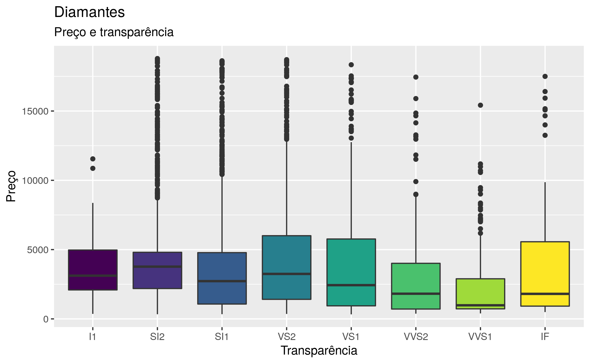

<!-- README.md is generated from README.Rmd. Please edit that file -->

# dados 

<!-- badges: start -->

[](https://cran.r-project.org/package=dados)
[](https://github.com/cienciadedatos/dados/actions)

<!-- badges: end -->

Este pacote disponibiliza a tradução de conjuntos de dados em inglês
originalmente disponíveis em outros pacotes de R. Os dados traduzidos
são utilizados nos exemplos do livro [R for Data
Science](https://r4ds.had.co.nz/) de Hadley Wickham & Garrett Grolemund,
cuja [versão em
português](https://altabooks.com.br/produto/r-para-data-science/) foi
publicada por AltaBooks & O’Reilly.

## Instalação

Este pacote pode ser instalado a partir do CRAN:

``` r
install.packages("dados")
```

A versão de desenvolvimento pode ser instalada a partir do GitHub:

``` r
# install.packages("remotes")
remotes::install_github("cienciadedatos/dados")
```

## Traduções

As traduções disponíveis dentro de `dados` são as seguintes:

| Nome | Título | Pacote | Dataset |
|:---|:---|:---|:---|
| casas | Dados de habitação em Ames | AmesHousing | ames_raw |
| premios_gerentes | Tabela de prêmios dos gerentes | Lahman | AwardsManagers |
| rebatedores | Tabela de estatíticas de Beisebol | Lahman | Batting |
| jardineiros | Tabela de estatísticas do jardineiro | Lahman | Fielding |
| gerentes | Tabela de gerentes | Lahman | Managers |
| pessoas | Tabela de pessoas | Lahman | People |
| arremessadores | Tabela de estatísticas de arremessadores | Lahman | Pitching |
| salarios | Tabela de salários | Lahman | Salaries |
| bebes | Nomes de bebês | babynames | babynames |
| velho_fiel | Dados do gêiser Velho Fiel (Old Faithful) | datasets | faithful |
| dados_iris | Dados de espécies de flor de Íris por Edgar Anderson | datasets | iris |
| mtcarros | Testes de estrada para automóveis | datasets | mtcars |
| dados_starwars | Personagens de Starwars | dplyr | starwars |
| questionario | Amostra de variáveis categóricas do questinário ‘General Social Survey’ (GSS) | forcats | gss_cat |
| comuns | Modelos comuns de carros | fueleconomy | common |
| veiculos | Dados de economia de combustível | fueleconomy | vehicles |
| dados_gapminder | Dados de Gapminder | gapminder | gapminder |
| diamante | Preço de 50 mil diamantes | ggplot2 | diamonds |
| milhas | Dados de economia de combustível de 1999 a 2008 para 38 modelos populares de carros | ggplot2 | mpg |
| presidentes_eua | Período que engloba 12 presidentes, desde Eisenhower até Trump | ggplot2 | presidential |
| dados_atmosfera | Dados atmosféricos | nasaweather | atmos |
| companhias_aereas | Nomes de companhias aéreas | nycflights13 | airlines |
| aeroportos | Aeroportos | nycflights13 | airports |
| voos | Dados de voos | nycflights13 | flights |
| avioes | Dados de aviões | nycflights13 | planes |
| clima | Dados de clima | nycflights13 | weather |
| pinguins | Medidas de pinguins adultos perto da Estação Palmer, Antártida (Palmer Station) | palmerpenguins | penguins |
| pixar_oscars | Filmes da Pixar com indicações ao Oscar | pixarfilms | academy |
| pixar_bilheteria | Bilheteria dos filmes da Pixar | pixarfilms | box_office |
| pixar_generos | Gêneros dos filmes da Pixar | pixarfilms | genres |
| pixar_filmes | Filmes da Pixar | pixarfilms | pixar_films |
| pixar_equipe | Equipe dos filmes | pixarfilms | pixar_people |
| pixar_avalicao_publico | Filmes da Pixar e avaliações | pixarfilms | public_response |
| top100musicas | Top 100 músicas da Billboard no ano 2000 | tidyr | billboard |
| cms_paciente_experiencia | Dados dos Centros de Serviços de Assistência Médica (*Medicare*) e Medicamentos (*Medicaid*) | tidyr | cms_patient_experience |
| nucleo_familiar | Dados de núcleo familiar | tidyr | household |
| tabela1 | Registros de tuberculose da Organização Mundial da Saúde (primeira variante) | tidyr | table1 |
| tabela2 | Registros de tuberculose da Organização Mundial da Saúde (segunda variante) | tidyr | table2 |
| tabela3 | Registros de tuberculose da Organização Mundial da Saúde (terceira variante) | tidyr | table3 |
| tabela4a | Registros de tuberculose da Organização Mundial da Saúde (variante 4a) | tidyr | table4a |
| tabela4b | Registros de tuberculose da Organização Mundial da Saúde (variante 4a) | tidyr | table4b |
| tabela5 | Registros de tuberculose da Organização Mundial da Saúde (quinta variante) | tidyr | table5 |
| dados_oms | Dados de tuberculose da Organização Mundial da Saúde | tidyr | who |
| dados_oms2 | Dados de tuberculose da Organização Mundial da Saúde | tidyr | who2 |

Os dados para praticar a manipulação de strings são `frases`, `palavras`
e `frutas`.

## Uso

O pacote `dados` pode ser carregado como qualquer outro pacote de R:

``` r
library(dados)
library(ggplot2)
library(dplyr)
```

Ao carregar o pacote, as variáveis que contêm os dados estarão
disponíveis imediatamente para uso. Porém, os dados não serão traduzidos
até que a variável seja “chamada” explicitamente por um comando. Neste
exemplo, o conjunto de dados `diamante`, que provém de
`ggplot2::diamonds`, é carregado no *workspace* do R no momento em que o
chamamos pela primeira vez em português:

``` r
glimpse(diamante)
#>  NULL
```

Os dados traduzidos permanecerão carregados em sua sessão de R:

``` r
diamante %>%
  filter(corte == "Bom") %>%
  ggplot() +
  geom_boxplot(aes(transparencia, preco, fill = transparencia)) +
  theme(legend.position = "none") +
  labs(title = "Diamantes", subtitle = "Preço e transparência", y = "Preço", x = "Transparência")
```



## Funções internas de `dados`

As funções internas de `dados` foram desenvolvidas originalmente por seu
pacote irmão: [`datos`](https://cienciadedatos.github.io/datos/).
